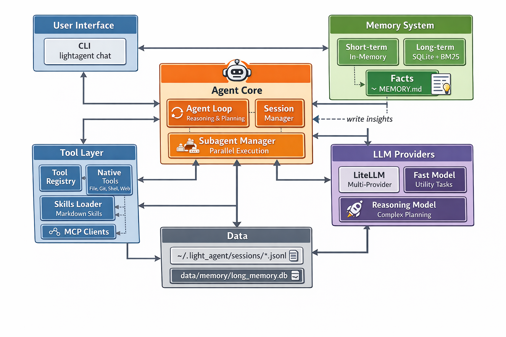
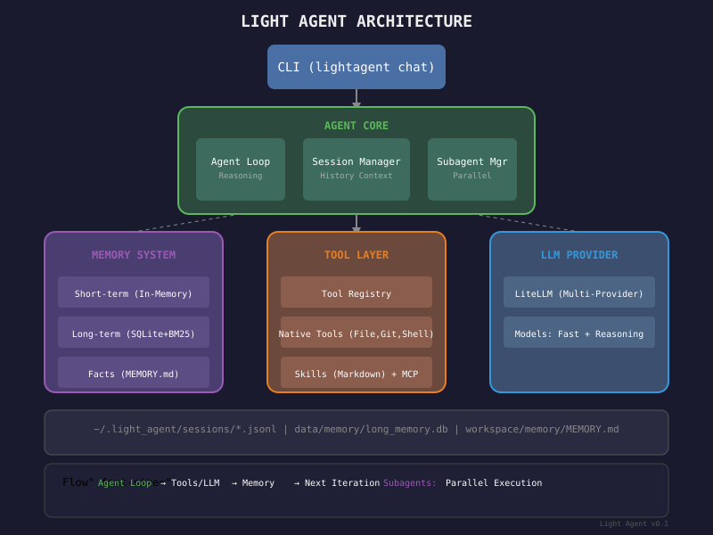

# Light Agent

<div align="center">



[](https://opensource.org/licenses/MIT)
[](https://www.python.org/downloads/)
[](https://github.com/adilsonmenechini/light-agent/commits/main)
[](https://github.com/adilsonmenechini/light-agent/graphs/commit-activity)

**Lightweight AI Agent** designed for local execution, portability, and everyday tasks.

[Quick Start](#quick-start) • [Documentation](docs/getting-started.md) • [Contributing](CONTRIBUTING.md)

</div>

---

## Quick Start

```bash
# Install
git clone https://github.com/adilsonmenechini/light-agent.git
cd light-agent
uv sync

# Interactive chat
uv run lightagent chat

# Single prompt
uv run lightagent chat "Analyze my codebase"
```

## Docker

```bash
# Build
docker build -t light-agent .

# Interactive
docker run -it --rm -v $(pwd)/workspace:/app/workspace light-agent

# With env file
docker run -it --rm -v $(pwd)/.env:/app/.env light-agent
```

## Architecture



## Documentation

- [Getting Started](docs/getting-started.md) - Quick start guide
- [Features](docs/features.md) - Core features overview
- [Architecture](docs/architecture.md) - System design
- [Status](docs/status.md) - Project status and roadmap
- [Workspace](docs/workspace.md) - Customization guide
- [Providers](docs/providers.md) - LLM setup
- [Tools & MCP](docs/tools_mcp.md) - Available tools
- [Librarian](docs/librarian_tools.md) - Web research tools
- [Observations](docs/observations.md) - Tool Observations 2.0 guide
- [12-Factor Implementation](docs/12factor_implementation.md) - 12-factor agent patterns
- [Git Operations](docs/git_operations.md) - Git workflow documentation
- [Development](docs/development_guide.md) - Contributing code
- [Contributing](CONTRIBUTING.md) - How to help
